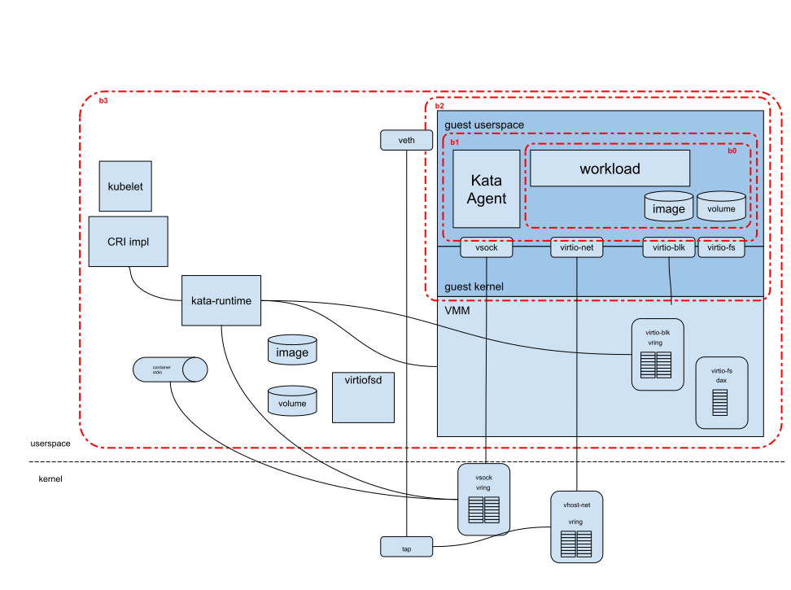

# Kata Containers threat model

This document discusses threat models associated with the Kata Containers project.
Kata was designed to provide additional isolation of container workloads, protecting
the host infrastructure from potentially malicious container users or workloads. Since
Kata Containers adds a level of isolation on top of traditional containers, the focus
is on the additional layer provided, not on traditional container security.

This document provides a brief background on containers and layered security, describes
the interface to Kata from CRI, a review of utilized virtual machine interfaces, and then
a review of threats.

todo: toc here

## Kata security objective

Kata seeks to prevent an untrusted container workload or user to gain access to (gain information
or tamper with) the host infrastructure.

In our scenario, the asset is anything on the host system, or elsewhere in the cluster
infrastructure. The attacker is assumed to be either a malicious user or the workload itself
running within the container. Kata’s goal is to prevent and such attacks which would allow
any acesss to the defined assets.

## Background on containers, layered security

Traditional containers leverage several key Linux kernel features to provide isolation and
a view that the container workload is the only entity running on the host. Namespaces, cgroups,
capablities, seccomp, etc.

Kata Containers seeks to provide a second layer of isolation on top of those
provided by traditional namespace-containers. The hardware virtualization interface is
the basis of this additional layer. Kata launches a lightweight virtual machine, and
uses the guest’s linux kernel to create a container workload, or workloads in the case of
multi-container pods. In Kubernetes and in the Kata implementation, the sandbox is carried
out at the pod level. In Kata, this sandbox is created using a virtual machine.

todo: insert picture

Kata is currently designed to protect host infrastructure from untrusted container workloads.
From an attack point of view, we consider the actual container workload to be malicious.

## Interface to Kata Containers: CRI, v2-shim, OCI

A typical deployment of Kata Containers will be in Kubernetes by way of a CRI implementation.
On every node, Kubelet will interact with a CRI implementor, which will in turn interface with
an OCI based runtime, such as Kata Containers. Typical CRI implementors are cri-o and containerd.

The CRI API, as defined at the Kubernetes [CRI-API repo](https://github.com/kubernetes/cri-api/),
results in a few constructs being supported by the CRI implementation, and ultimately in the OCI
runtime creating the workloads:

Kata integrates with CRI implementations (CRIO and containerd) In order to run a container, several
devices need to be exposed:

These devices map to virtual machine devices and interfaces.

Kata translates sandbox and container definitions to underlying virtualization technologies provided
by a set of virtual machine monitors (VMMs) and hypervisors. These devices and their underlying
implementations are discussed in detail in the following section.

## Interface to the Kata sandbox/virtual machine

In case of Kata, today the devices which we need in the guest are:
virtio-blk and/or virtio-fs: In the current design of Kata Containers, we are reliant on the CRI implementor to assist in image handling and volume management on the host. As a result, we need to support a way of passing in rootfs, volumes, configmaps, etc, into the sandbox. Depending on how these are managed, a block based device  or file-system sharing is required. Kata Containers does this by way of virtio-blk/scsi or virtio-fs. In prior versions of Kata, virtio-9pfs was made available. This isn’t actively maintained upstream, is not performant, and is problematic from a POSIX compliance standpoint. As a result, we recommend users leverage virtio-blk/scsi and/or virtio-fs going forward
Virtio-net: lalala, unless you use direct device assignment, blah blah
Virtio-vsock: In order to interact with the guest agent and retrieve STDIO from containers, a medium of communication is required. This is available via virtio-vsock.

Other interfaces which may be utilized include VFIO (direct device assignment) and ACPI for dynamic VM resource management (ie, hotplug).

How these devices are utilized varies depending on the VMM utilized. We clarify the default settings provided when integrating Kata with the QEMU VMM, Firecracker VMM, and Cloud Hypervisor VMM (integration of Cloud Hypervisor is in progress, expected in 1.10 release of Kata Containers) in the following sections.

### Devices

#### virtio-blk/-scsi

The backend for virtio-blk and -scsi are based in the VMM itself (ring3 in the context of x86) by default.
While vhost based backends are available for QEMU, it is not recommended. vhost-user backends are under consideration
in the future, but not utilized in any of the existing Kata configurations.

#### virtio-FS

virtio-FS's interaction with the host filesystem is done through a vhost-user daemon. The virtio-fs client, running in
the guest, will generate requests to access files. `virtiofsd` will receive requests, open the file, and request the VMM to `mmap` it into the guest. The guest will access the file using DAX, utilizing the host's page cache, thus avoiding copy and duplication.

This is still new development. DAX-less support is available in the 5.4 Linux kernel. QEMU VMM supports virtio-fs as of v4.2,
and upstreaming of `virtiofsd` is in progress.

#### virtio-net

Virtio-net has many options, depending on the VMM and Kata configurations.

##### QEMU

While QEMU has options for vhost, virtio-net and vhost-user, the virtio-net backend
for Kata defaults to vhost-net for performance reasons. The default configuration is being
reevaluated.

##### Firecracker

For Firecracker, the backend is within Firecracker's VMM.

##### Cloud Hypervisor

For Cloud Hypervisor, the current backend default is virtio-net (in the VMM). vhost-user-net support
is being added (written in rust, Cloud Hypervisor specific).

#### virtio-vsock

##### QEMU

In QEMU, vosck is backed by `vhost_vsock`, which runs within the kernel itself (ring0 in the context of x86).

##### Firecracker and Cloud Hypervisor

In Firecracker and Cloud Hypervisor, vsock is backed by a unix-domain-socket in the hosts userspace.

#### VFIO

Utilizing VFIO, devices can be passed through to the virtual machine. We will assess this separately. Exposure to
host is limited to gaps in device pass-through handling. This is supported in QEMU and Cloud Hypervisor, but not
Firecracker.

#### ACPI

ACPI is necessary for hotplug of CPU, memory and devices. ACPI is available only in QEMU. In Firecracker and 0.3 Cloud Hypervisor,
there isn’t the capability to hotplug deviecs, memory, or CPUs.

## Devices and threat model

### Risks

